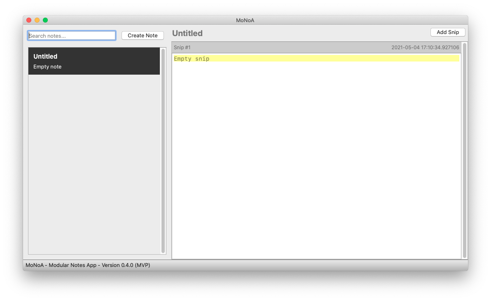
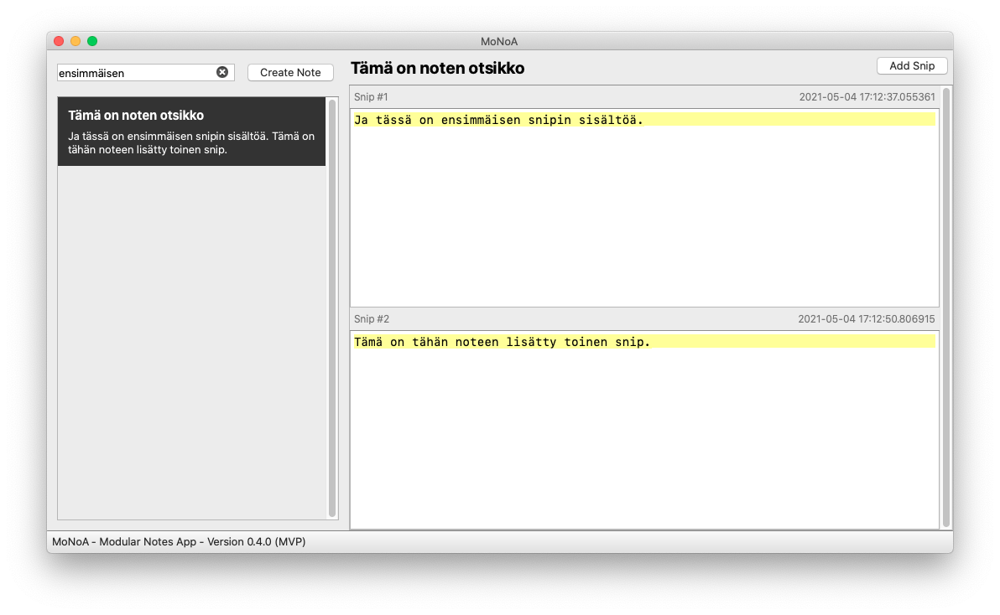

# Käyttöohje: MoNoA - Modular Notes App (0.4.0)

Sovelluksen viimeisin julkaistu [release](https://github.com/algoholik/modularnotes/releases) 
lähdekoodeineen on "Ohjelmistotekniikka Viikko 6" (_Assets_ -> _Source code_).


## Sovelluksen suoritus

Asenna ennen ohjelman käynnistämistä tarvittavat riippuvuudet komennolla:
```
poetry install
```

Sekä tee alustustoimenpiteet komennolla:
```
poetry run invoke build
```

Sovelluksen voi nyt suorittaa komennolla:

```
poetry run invoke start
```

## Aloitusnäkymä

Sovellus käynnistyy suoraan ensisijaiseen käyttönäkymään, ja käyttäjää tervehditään vastikään 
luodulla ensimmäisellä tyhjällä notella.



## Toiminnot

- Uusia muistiinpanoja (notes) luodaan vasemman palstan yläreunan "Create Note" -painikkeella.
- Muistiinpanon muodostavia palasia (snips) voidaan luoda auki olevan muistiinpanon sisään 
oikean yläkulman "Add Snip" -painikkeella.
- Muistiinpanon otsikkoa voi muokata klikkaamalla ylhäällä keskellä olevaa tekstialuetta.
- Käyttäjä voi etsiä muistiinpanoja syöttämällä vasemman yläkulman "Search notes..." -tekstikenttään 
hakusanan jolla vasemman reunan lista muistiinpanoista päivittyy näyttämään hakutulokset. Hakutuloksista 
palataan kaikki muistiinpanot näyttävään näkymään hakukentän oikean reunan X-painikkeesta.
- Kaikki käyttäjän luomat notet ja snipit sekä niihin tehdyt muutokset tallentuvat automaattisesti.


